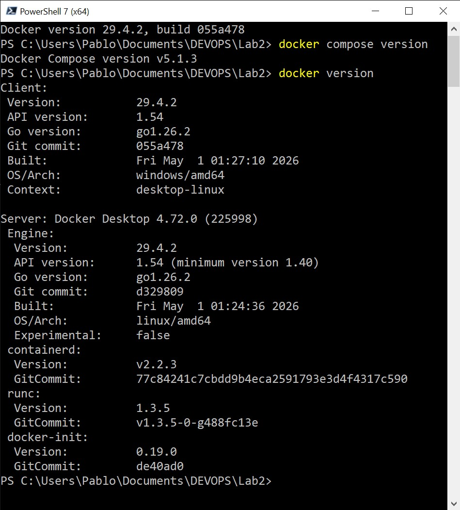
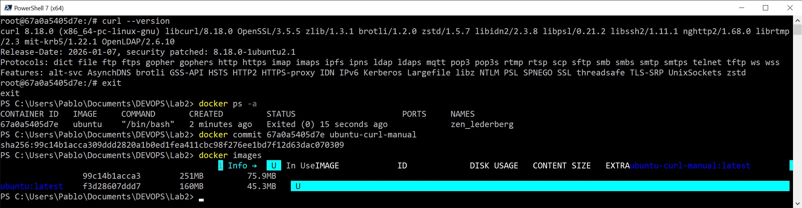
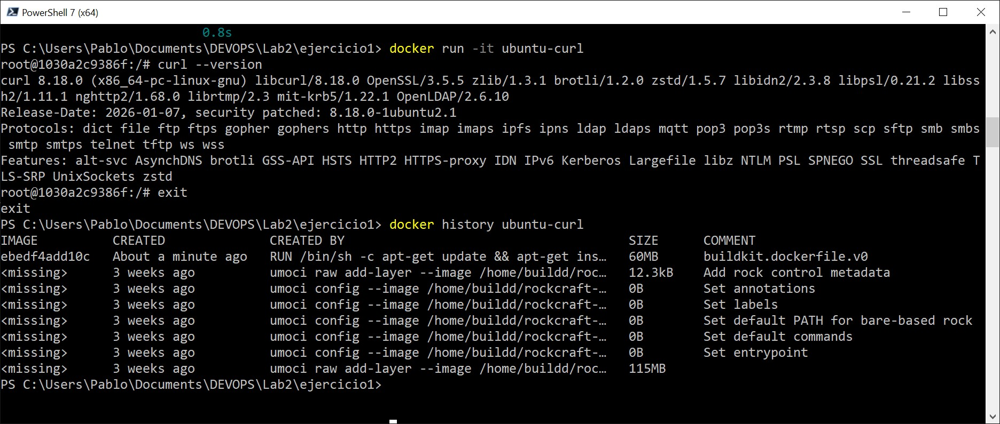
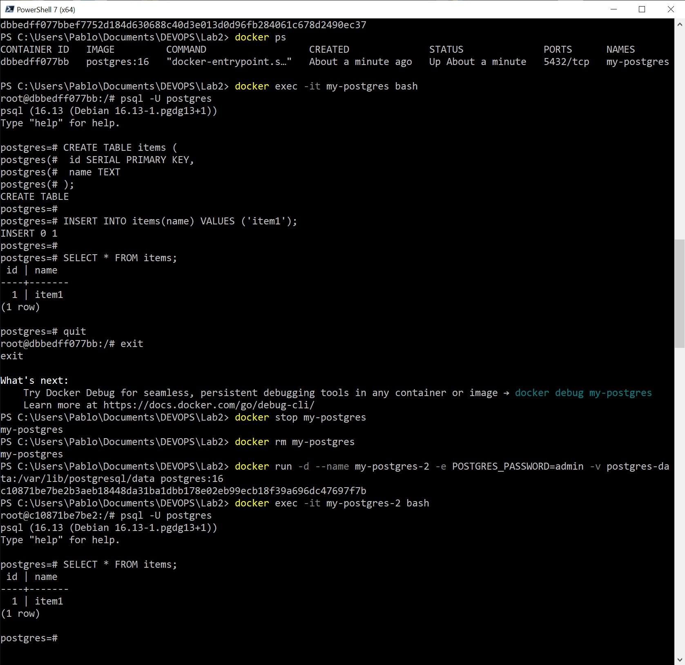
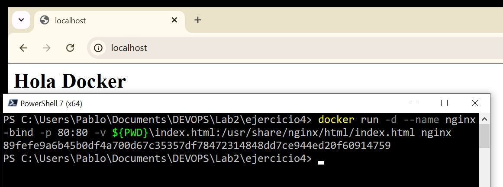
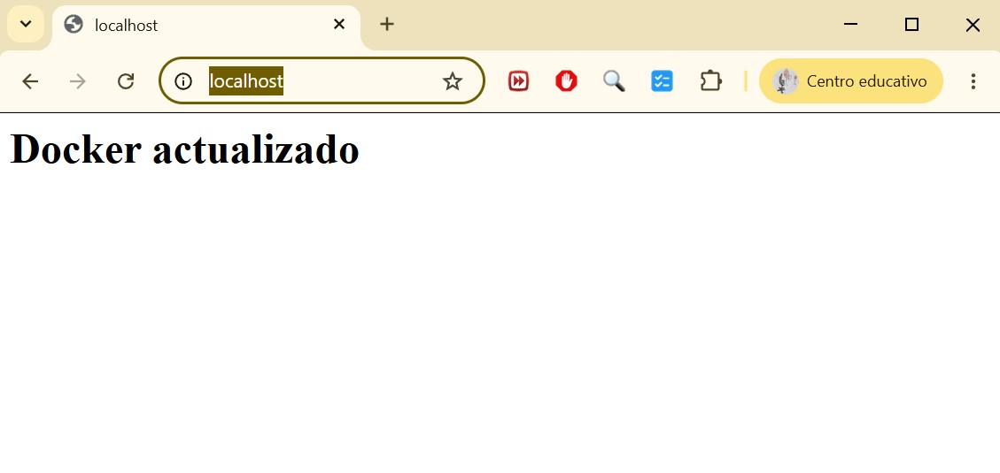
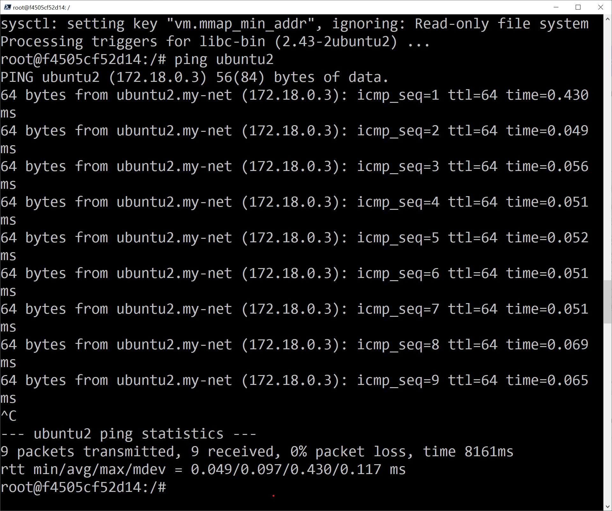
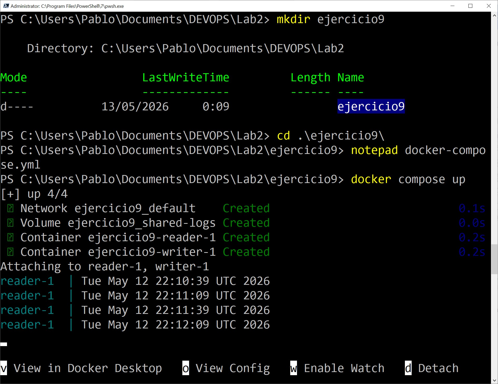

# Laboratorio Docker

Alumno: Pablo Carmona Guerrero

GitHub: pcargue

---

# Introducción

En este laboratorio se han realizado distintas pruebas básicas con Docker para trabajar con:

- imágenes
- contenedores
- volúmenes
- redes
- Docker Compose

---

# Comprobación inicial

Comprobamos que Docker y Docker Compose funcionan correctamente.

```bash
docker --version
docker compose version
```



---

# Ejercicio 1 — Creando imágenes

## Crear contenedor Ubuntu

```bash
docker run -it ubuntu
```

---

## Instalar curl

Dentro del contenedor:

```bash
apt-get update
apt-get install -y curl
```

Comprobación:

```bash
curl --version
```



---

## Guardar cambios como nueva imagen

Comando:

```bash
docker commit ID_CONTENEDOR nueva-imagen
```

Ejemplo:

```bash
docker commit abc123 ubuntu-curl
```

---

# Dockerfile

Se crea un archivo `Dockerfile`:

```dockerfile
FROM ubuntu

RUN apt-get update && apt-get install -y curl
```

Construcción de imagen:

```bash
docker build -t ubuntu-curl .
```

Ejecución:

```bash
docker run -it ubuntu-curl
```

---

## Ver capas de la imagen

```bash
docker history ubuntu-curl
```



---

# Ejercicio 3 — Volúmenes persistentes

## Crear volumen

```bash
docker volume create postgres-data
```

---

## Crear contenedor PostgreSQL

```bash
docker run -d \
--name my-postgres \
-e POSTGRES_PASSWORD=admin \
-v postgres-data:/var/lib/postgresql/data \
postgres
```

---

## Entrar al contenedor

```bash
docker exec -it my-postgres bash
```

---

## Acceder a PostgreSQL

```bash
psql -U postgres
```

---

## Crear tabla

```sql
CREATE TABLE items (
 id SERIAL PRIMARY KEY,
 name TEXT
);
```

---

## Insertar registro

```sql
INSERT INTO items(name) VALUES ('item1');
```

---

## Verificar contenido

```sql
SELECT * FROM items;
```



---

## Comprobar persistencia

Se elimina el contenedor:

```bash
docker stop my-postgres
docker rm my-postgres
```

Se crea otro usando el mismo volumen:

```bash
docker run -d \
--name my-postgres-2 \
-e POSTGRES_PASSWORD=admin \
-v postgres-data:/var/lib/postgresql/data \
postgres
```

Al volver a consultar la tabla, los datos siguen existiendo.

---

# Ejercicio 4 — Bind mounts

## Crear archivo HTML

```bash
nano index.html
```

Contenido:

```html
<h1>Hola Docker</h1>
```

---

## Ejecutar nginx

```bash
docker run -d \
--name nginx-bind \
-p 80:80 \
-v $(pwd)/index.html:/usr/share/nginx/html/index.html \
nginx
```

Abrimos en navegador:

```text
http://localhost
```



---

## Modificar archivo local

Nuevo contenido:

```html
<h1>Docker actualizado</h1>
```

Al refrescar el navegador, los cambios aparecen automáticamente.



---

## Pregunta

Los cambios se reflejan inmediatamente porque el archivo está enlazado directamente entre el host y el contenedor.

---

# Ejercicio 6 — Redes privadas

## Crear red

```bash
docker network create my-net
```

---

## Crear contenedores

```bash
docker run -it --name ubuntu1 --network my-net ubuntu
```

```bash
docker run -it --name ubuntu2 --network my-net ubuntu
```

---

## Instalar ping

```bash
apt-get update
apt-get install -y iputils-ping
```

---

## Probar conectividad

Desde ubuntu1:

```bash
ping ubuntu2
```



---

## Pregunta

Sí, los contenedores pueden comunicarse entre sí porque pertenecen a la misma red Docker.

---

# Ejercicio 9 — Docker Compose

## Crear docker-compose.yml

```yaml
services:

  writer:
    image: ubuntu
    command: >
      bash -c "while true;
      do date >> /app/logs/output.log;
      sleep 30;
      done"
    volumes:
      - shared-logs:/app/logs

  reader:
    image: ubuntu
    command: tail -f /app/logs/output.log
    volumes:
      - shared-logs:/app/logs:ro

volumes:
  shared-logs:
```

---

## Ejecutar Docker Compose

```bash
docker compose up
```



---

# Conclusiones

Con este laboratorio he practicado el uso básico de Docker:

- creación de imágenes
- uso de Dockerfile
- persistencia de datos
- bind mounts
- redes privadas
- Docker Compose

También he comprobado cómo Docker facilita el despliegue y aislamiento de aplicaciones.
